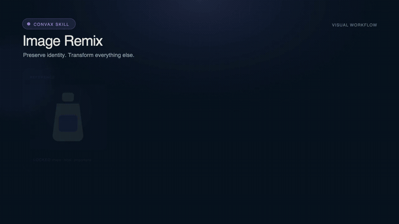

[English](README.md) | [简体中文](README.zh-CN.md)

# Convax Plugins

The official source registry, authoring kit, and release catalog for Convax
Plugins and portable [Agent Skills](https://agentskills.io/). Published Skills
follow the open `SKILL.md` format and can be used by compatible agents such as
OpenAI Codex; they are not designed exclusively for Convax.

This repository lets people and AI agents start from a template and produce a
Plugin or Skill that can be validated independently, packaged deterministically,
and downloaded safely by Convax. Package source is reviewed in Git, immutable ZIPs
are published through GitHub Releases, and GitHub Pages hosts the lightweight
Registry at
`https://microvoid.github.io/convax-plugins/registry/v1/index.json`.



Featured Skills can publish a poster and an animation beside their immutable
Release ZIP. Convax verifies that media through the separate Showcase index and
plays it in the catalog; the media never becomes part of the portable Skill.

## Quick start

Requirements: [Bun](https://bun.sh/) 1.3.14 or newer.

Install the complete workspace graph once. Every Plugin, Skill, and Tool owns its
dependencies in its own `package.json`; the root lockfile keeps the monorepo
reproducible without CI-specific package lists.

```sh
bun install --frozen-lockfile --ignore-scripts
```

```sh
cp -R templates/plugin-basic packages/plugins/my-plugin
# Replace every __TOKEN__ and implement package/index.html.
bun run validate
bun test
bun run pack -- --kind plugin --id my-plugin
```

For a Skill, start from the portable Skill template instead:

```sh
cp -R templates/skill-basic packages/skills/my-skill
# Replace every __TOKEN__ in convax-package.json, SKILL.md, and agents/openai.yaml.
bun run validate
bun test
bun run pack -- --kind skill --id my-skill
```

The generated Plugin ZIP has `manifest.json` at its root. A Skill ZIP has
`SKILL.md` at its root. No dependency install or contributor build script is run
while validating or packing a package.

New executable Tool Plugins use `convax.plugin/3` and may be headless; use
`convax.plugin/4` when the same Plugin also owns Skills. Both schemas separate
executable tools, model-picker entries, Agent tools, and Canvas selection actions so
hosts can compose every Plugin without checking its id. Their ZIP still
contains only inert package files: it declares a separately installed bare
`mcp-stdio` command for generation and/or fixed service actions, and never embeds
that executable, its dependencies, vendor credentials, or provider configuration. See
[`docs/plugin-authoring.md`](docs/plugin-authoring.md#declarative-tool-plugin).
For reviewed first-party tools, the Registry publishes exact
platform/architecture companion artifacts beside the ZIP. Convax verifies their
size and SHA-256 into host-owned storage, so users do not install a sidecar through
`PATH` and executables still never enter a Plugin package.

`convax.plugin/4` adds Plugin-owned Skills. A v4 Plugin declares
`contributes.skills`, and the packer injects each referenced standard Skill
workspace into the Plugin ZIP. Convax may show that Skill in its catalog, but its
install, update, and removal lifecycle belongs to the Plugin. The standalone Skill
ZIP remains portable to Codex and other Agent Skills clients. Because the same source
changes both archives, an owned Skill release must also bump and publish its owner
Plugin; release coverage verifies the deterministic bytes of both.

`convax.plugin/5` adds transport-neutral host capabilities, including a sandboxed
desktop pet feature. One Pet feature Plugin uses the
`convax.plugin-capability/1` compatibility pair and contributes static overlay and
settings surfaces plus a `convax.pet-library/1` packaged collection through
`contributes.pet`. The surfaces use the scoped `convax.pet-host/1` protocol; Convax
retains only the native window, content-free activity projection, validated
navigation, installed asset serving, and bounded persistence. See the working package in
[`packages/plugins/convax-pet`](packages/plugins/convax-pet).

See the working example in
[`packages/plugins/hello-convax`](packages/plugins/hello-convax), then read:

- [`docs/plugin-authoring.md`](docs/plugin-authoring.md) for the sandbox and host protocol;
- [`docs/skill-authoring.md`](docs/skill-authoring.md) for safe, portable Skills;
- [`docs/packaging.md`](docs/packaging.md) for ZIP and release rules;
- [`docs/registry-spec.md`](docs/registry-spec.md) for the client contract;
- [`CONTRIBUTING.md`](CONTRIBUTING.md) before opening a pull request.

## Portable Skill boundary

For a Skill package, only the contents of `package/` are placed in the published
ZIP. That directory is a standard Agent Skill root: `SKILL.md` is required, while
`scripts/`, `references/`, `assets/`, and client metadata such as
`agents/openai.yaml` are optional. A compatible client may ignore metadata intended
for another client without changing the Skill workflow.

Do not add a `README.md`, installation guide, changelog, or publishing notes to an
individual Skill bundle. `SKILL.md` is the agent-facing entry point; repository and
marketplace documentation belongs outside `package/`. Likewise,
`convax-package.json` stays beside `package/`. It describes Convax catalog and
release metadata and is deliberately excluded from the portable Skill ZIP.

A Skill may name a host integration, but it must first use capabilities actually
available in the current session. Optional tool absence, denial, cancellation, or
failure must have an honest fallback: produce a useful handoff when possible, or
stop and identify the unavailable operation. Never invent a tool call or claim an
artifact, installation, or mutation succeeded when it did not.

## Install in Convax

Open **Settings → Skills and Plugins** in a compatible Convax build. The catalog is
loaded from the public Registry above; selecting **Install Plugin** or **Install
Skill** sends only the package id to Convax main, which downloads and validates the
corresponding immutable Release ZIP.
If a v2, v3, v4, or v5 Plugin declares Registry companions, the same install transaction selects
only the exact local platform/architecture artifact and verifies its immutable URL,
byte count, and SHA-256 separately from the static ZIP.
For v4 and v5, Plugin-owned Skills are admitted and removed in that same Plugin transaction;
they are never an independent Convax install action.

The `microvoid/convax-plugins` repository, Registry, and Release assets are public
and require no GitHub account or token. The main `microvoid/convax` application
repository may remain private without affecting package installation.

## Repository layout

```text
packages/plugins/<id>/
  package.json             # workspace dependencies and contributor scripts
  convax-package.json      # Convax publishing metadata; excluded from the ZIP
  package/                 # ZIP root; manifest.json must be here
packages/skills/<id>/
  package.json             # workspace dependencies and contributor scripts
  convax-package.json      # Convax publishing metadata; excluded from the ZIP
  package/                 # portable Skill root; SKILL.md must be here
  showcase/                # optional catalog poster/animation; excluded from ZIP
packages/tools/<id>/       # reviewed Tool workspace; separately distributed
templates/                 # copy-only author starters
tooling/                   # validation and deterministic ZIP
schemas/                   # package, Registry, and Plugin JSON Schemas
dist/                      # generated; never committed
```

## Commands

```sh
bun run validate            # validate all source packages
bun run workspaces:build:packages # build self-contained Skill/Plugin package trees
bun run workspaces:typecheck # type-check workspaces that declare the script
bun run workspaces:test     # test workspaces that declare the script
bun test                    # validator, ZIP, Registry, and protocol tests
bun run render:showcases -- --id ad-idea # render one poster and animation
bun run build:companions    # compile explicitly reviewed platform targets
bun run pack                # pack every package into dist/packages
bun run build:index         # create matching Registry and Showcase indexes
bun run check               # complete local CI sequence
```

To publish one package, create an annotated tag that exactly matches its metadata:

```text
plugin-<id>-v<version>
skill-<id>-v<version>
```

For example: `plugin-hello-convax-v0.1.0`. The publish workflow validates the
tag, creates the deterministic ZIP and Registry entry, attests the ZIP, and creates
a GitHub Release. The Pages workflow rebuilds the catalog from published Release
entries only.

## Troubleshooting installation

- `Redirect was cancelled` indicates an older Convax host that did not adapt
  Electron's manual redirect behavior for GitHub Release downloads. Update to a
  build containing the Electron Release redirect adapter.
- `Unable to connect` usually indicates a proxy, DNS, firewall, or offline problem.
  Verify that both the Registry URL and the package's `artifact.url` are reachable
  from the same machine.
- HTTP `404` or `403` should be checked against the public URLs in the Registry. No
  request should depend on access to the private Convax application repository.
- A size, SHA-256, schema, compatibility, or ZIP validation failure is intentional
  fail-closed behavior. Do not bypass it; inspect the published Registry entry and
  Release asset instead.

## Trust boundary

Third-party Plugin ZIPs are inert. Web surfaces are static HTML/CSS/JavaScript
rendered by Convax in an iframe with exactly `sandbox="allow-scripts"`; they cannot
contain native executables, Node/Electron code, network permissions, or a generic
host bridge. A v2, v3, v4, or v5 Tool Plugin may name a separately installed external command.
Convax resolves and fingerprints it during explicit Plugin install/update; that
transaction is consent to the exact binding, so later calls do not show a separate
command prompt. It never becomes part of the ZIP. A Registry companion is an independent immutable Release asset,
admitted only after exact target, size, and digest verification. Every host call is
scoped to the mounted Plugin node and checked
against the manifest capability allowlist. Skills are instructions, not executable
capability grants.

## License

Repository tooling, templates, and `hello-convax` are MIT licensed. Each submitted
package must declare its license and include notices its dependencies require.
